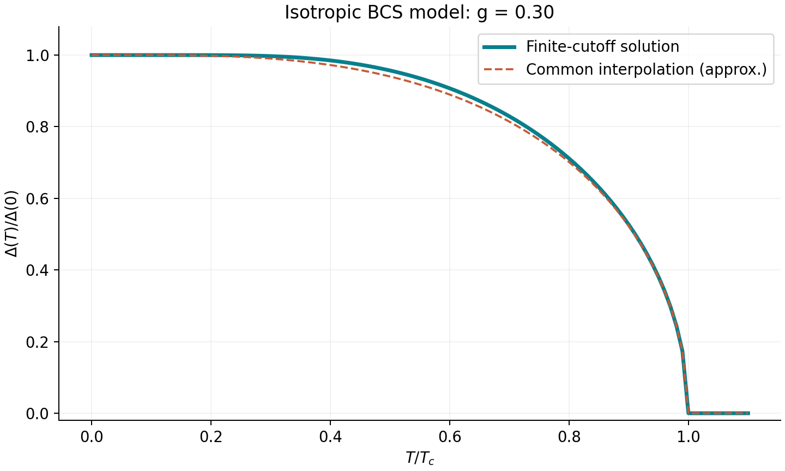
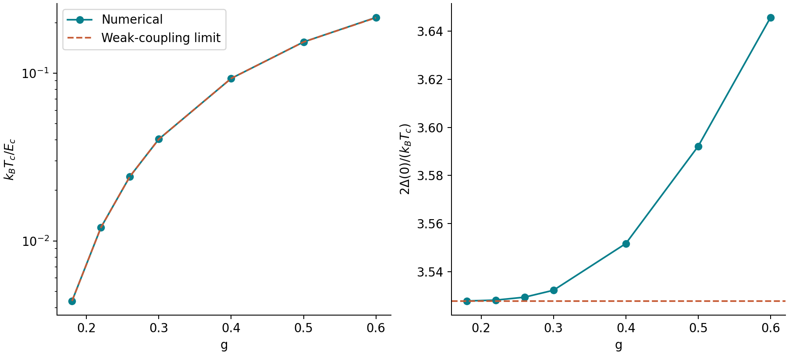
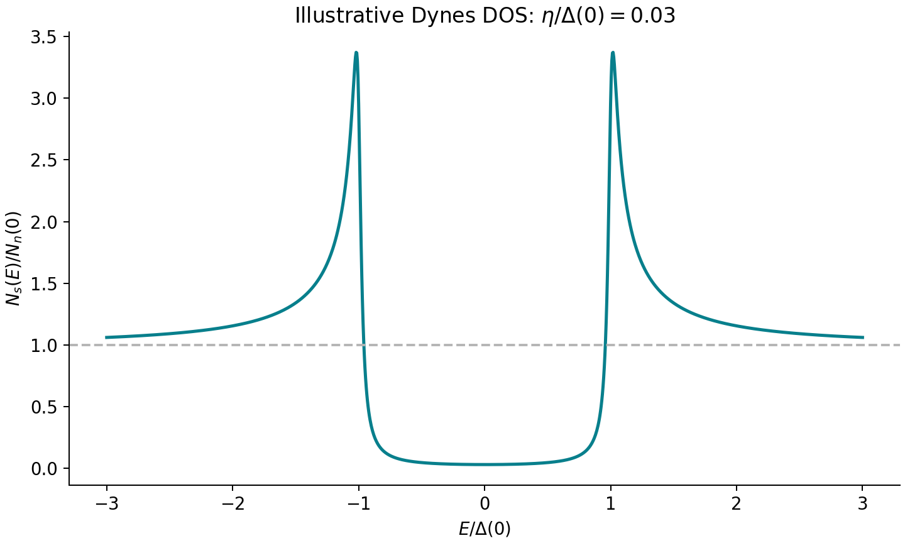

# BCS 超导理论与计算入门教程

[本课入口](README.md) · [交互代码](BCS入门交互教程.ipynb) · [结果验证](验证报告.md)

本教程面向会基础 Python、微积分和线性代数，但尚未系统学习超导理论的读者。目标是从一个可验证模型推导能隙方程、求解温度依赖并判断结果是否可靠。

建议分三次学习：第一次读物理与推导，第二次逐格运行 Notebook，第三次完成练习。图像全部由配套程序生成。

## 1. 我们计算什么

超导涉及电子配对以及宏观相位相干。这里计算均匀、各向同性的 BCS 平均场序参量 Δ 和准粒子谱。输入是有效吸引 V 和作用能量范围 E_c，输出是 Δ(T)、模型临界温度 Tc 和理想化态密度。

本课没有从第一性原理推导 V，也没有显式计算声子。后续材料计算需要电子-声子矩阵元或其他相互作用，以替代这里假设的配对输入。

均匀、无流、无破对的各向同性模型中，最小正准粒子能量为 |Δ|。一般材料中序参量幅度、谱隙和相位相干尺度可能不同。

## 2. 符号与先修概念

| 符号 | 英文概念 | 本课约定 |
|---|---|---|
| ε_k | Band energy | 单电子能带能量 |
| μ | Chemical potential | 化学势 |
| ξ_k=ε_k−μ | Energy relative to μ | 相对化学势的能量 |
| c†、c | Creation / annihilation operator | 创建/湮灭一个费米子 |
| V>0 | Effective attraction magnitude | 吸引大小，Hamiltonian 中显式写 −V |
| N₀ | Single-spin density of states | 单自旋常 DOS，体积/格点归一化与 V 配套 |
| g=N₀V | Dimensionless coupling | 无量纲有效吸引 |
| E_c | Pairing energy cutoff | 只在 |ξ|<E_c 中配对；E_c 是能量 |
| Δ | Pairing order parameter | 复数序参量；均匀问题可选规范为实非负 |
| E_k | Quasiparticle energy | √(ξ_k²+|Δ|²) |
| t=k_BT/E_c | Dimensionless temperature | 程序 temperature 的含义 |
| d=Δ/E_c | Dimensionless gap | 程序 delta 的含义 |

若资料给的是双自旋总 DOS，此处 N₀=N_total/2。把双自旋 DOS 原样代入 g 会改变指数尺度。

二次量子化中 c†c 是占据算符。c_-k,down c_k,up 湮灭一对反向动量、相反自旋电子。它的期望值在正常态平均场为零，在配对态可以非零。

## 3. 约化 BCS Hamiltonian

费米面附近电子可以在合适吸引通道产生 Cooper 不稳定性。BCS 将它扩展为许多 k 态相干配对：

$$
H=\sum_{k\sigma}\xi_k c^\dagger_{k\sigma}c_{k\sigma}
-V\sum_{kk'}c^\dagger_{k\uparrow}c^\dagger_{-k\downarrow}
c_{-k'\downarrow}c_{k'\uparrow}.
$$

作用只在 |ξ_k|、|ξ_k'|<E_c 保留，求和归一化吸收入 V。声子体系中 E_c 常与声子能标有关，真实材料通常需要频率依赖、多带和屏蔽结构。

定义成对算符 B_k=c_-k,down c_k,up 和

$$
\Delta=V\sum_k\langle B_k\rangle.
$$

把 B†B 分解为平均值和涨落，舍去二阶涨落，得到平均场（mean-field）Hamiltonian：

$$
H_{\mathrm{MF}}=\sum_{k\sigma}\xi_k c^\dagger_{k\sigma}c_{k\sigma}
-\sum_k(\Delta B_k^\dagger+\Delta^*B_k)+\frac{|\Delta|^2}{V}.
$$

末项是常数修正，计算自由能时必须保留。

## 4. Nambu 表象与能谱

引入 Nambu spinor：

$$
\Psi_k=(c_{k\uparrow},c^\dagger_{-k\downarrow})^T,\quad
h_k=\begin{pmatrix}\xi_k&-\Delta\\-\Delta^*&-\xi_k\end{pmatrix}.
$$

由 det(h_k−EI)=0 得

$$
E_\pm=\pm E_k,\qquad E_k=\sqrt{\xi_k^2+|\Delta|^2}.
$$

Coherence factors（相干因子）为

$$
u_k^2=\frac12(1+\xi_k/E_k),\quad
v_k^2=\frac12(1-\xi_k/E_k),\quad
u_kv_k=\frac{\Delta}{2E_k}.
$$

最后一式使用与上面一致的实 Δ 和 Bogoliubov 变换约定。它们说明准粒子是电子与空穴混合。Nambu 的 ±E 不应再作为独立电子态额外乘 2。

## 5. 自洽能隙方程

有限温度 f(E)=1/[exp(E/k_BT)+1]，于是

$$
1-2f(E)=\tanh(E/2k_BT),\qquad
\langle B_k\rangle=\frac{\Delta}{2E_k}\tanh\frac{E_k}{2k_BT}.
$$

代回 Δ 定义，对非零 Δ 支路除以 Δ：

$$
1=V\sum_k\frac1{2E_k}\tanh\frac{E_k}{2k_BT}.
$$

替换为常 DOS 积分：

$$
1=VN_0\int_{-E_c}^{E_c}
\frac{\tanh(\sqrt{\xi^2+\Delta^2}/2k_BT)}
{2\sqrt{\xi^2+\Delta^2}}\,d\xi.
$$

核为偶函数，正负积分的因子 2 抵消分母 2：

$$
\boxed{\frac1g=\int_0^{E_c}
\frac{\tanh(\sqrt{\xi^2+\Delta^2}/2k_BT)}
{\sqrt{\xi^2+\Delta^2}}\,d\xi}.
$$

不同资料的 N₀、V 约定可能不同，比较前需对齐最终积分式。原自洽式始终允许 Δ=0；上式寻找非零支路，或取 Δ→0 判断其出现条件。

## 6. 无量纲化与解析极限

取 x=ξ/E_c、d=Δ/E_c、t=k_BT/E_c：

$$
\frac1g=\int_0^1\frac{\tanh(\sqrt{x^2+d^2}/2t)}
{\sqrt{x^2+d^2}}\,dx.
$$

### 零温

T=0、d>0 时 tanh→1：

$$
\frac1g=\operatorname{asinh}(1/d_0),\qquad
d_0=\frac1{\sinh(1/g)}.
$$

这是有限截断模型的精确结果。弱耦合 g≪1 时 d₀≈2 exp(−1/g)。

### 临界温度

令 d→0：

$$
\frac1g=\int_0^1\frac{\tanh(x/2t_c)}x\,dx.
$$

x→0 时核的极限是 1/(2t_c)，没有物理发散。弱耦合极限为

$$
t_c\simeq\frac{2e^{\gamma_E}}{\pi}e^{-1/g},\qquad
\frac{2\Delta(0)}{k_BT_c}\to\frac{2\pi}{e^{\gamma_E}}=3.52775\ldots
$$

γ_E 是 Euler 常数。3.53 是弱耦合值的近似；有限 g 可以有小偏差，该偏差不能替代强耦合 Eliashberg 理论。

## 7. 如何变成数值算法

定义 R(d,t)=I(d,t)−1/g 并寻找零点。固定 t 时积分随 d 增大而下降。T<Tc 的正根位于 [0,d₀]，T≥Tc 选择正常态 d=0。

使用 SciPy 的 quad 自适应积分与 brentq 括区间求根。Brent 方法需要两端异号，结合二分与插值。它可以避免从 Δ=0 直接自洽迭代时永远停在零解。

流程如下：

1. 精确公式得到 d₀。
2. 对 R(0,t) 求根得到 t_c。
3. 逐温度求非零 d(t)，Tc 以上返回零。
4. 将结果代回方程，保存残差。
5. 扫积分容差并与解析极限比较。

bcs.py 的 integral() 在零温用解析积分，在有限温度对核变化尺度设置 quad 分段点。critical_temperature() 与 gap() 用 d₀ 缩放求根变量，改善弱耦合时的容差控制。

极小 g 会产生指数小能标。教学程序对超出当前精度范围的参数报错；此时应改用对数变量，而不能把精度不足解释为无超导。

## 8. 最小可运行代码

在本课目录执行：

~~~python
from bcs import BCSModel
model = BCSModel(coupling=0.30)
tc = model.critical_temperature()  # k_B Tc / E_c
d0 = model.delta0_exact           # Delta(0) / E_c
print(d0, tc, 2*d0/tc)
print(model.gap(0.5*tc))
~~~

默认参考值：

~~~text
Delta(0)/E_c = 0.071438902256
k_B Tc/E_c  = 0.040449525191
2Delta(0)/(k_B Tc) = 3.532249237493
~~~

完整结果用 python run_bcs.py 重建。安装命令见 [README](README.md)。

## 9. 解释计算图像

### 能隙温度曲线

低温能隙变化指数小，Tc 附近降到零。虚线 tanh[1.74√(Tc/T−1)] 是近似插值，实线由积分求根独立生成。低温相邻点相同可能是变化低于浮点精度；Tc 附近需更密温度采样。

### 耦合扫描

左图显示指数能标，g 增大使本模型 Tc 上升。右图显示 g 变小时比值趋近 3.52775。不能要求任意 g 都正好等于 3.53。

### 态密度

清洁各向同性模型近费米能的归一化态密度为

$$
N_s(E)/N_n(0)=\operatorname{Re}\frac{|E|}{\sqrt{E^2-\Delta^2}}.
$$

为平滑奇点，程序用 Dynes 展宽 η>0：

$$
N_s(E)/N_n(0)=\operatorname{Re}\frac{|E|+i\eta}
{\sqrt{(|E|+i\eta)^2-\Delta^2}}.
$$

图中 η/Δ₀=0.03。展宽降低尖峰并产生隙内 DOS；η 是现象学输入，未从杂质散射求出。DOS 公式是近费米能常 DOS 近似，没有施加能隙积分的有限截断，应在低能范围解释。

## 10. 单位换算

假设 E_c=20 meV：

$$
T_c[\mathrm K]=t_c E_c[\mathrm{eV}]/k_B[\mathrm{eV/K}].
$$

使用 k_B=8.617333262145×10⁻⁵ eV/K，得到 Tc≈9.38794 K、Δ₀≈1.42878 meV。这是示例参数换算，不是材料预测。

固定 g、把 E_c 加倍时，Tc 与 Δ₀ 加倍，归一化曲线和比值不变。真实材料中改变声子能标时 DOS 和相互作用也可能改变。

## 11. 验证而不仅是画图

test_bcs.py 有七项检查：独立积分验证零温公式；g=0.18 的弱耦合极限；能隙非增趋势与残差；Tc 端点；耦合与 Tc 趋势；DOS 对称性与正常极限；单位与非法输入。

convergence.csv 比较积分容差 10⁻⁶、10⁻⁸、10⁻¹⁰。它验证本积分稳定性，不能替代真实材料的 k/q 网格收敛。

~~~bash
python -m unittest -v test_bcs.py
~~~

## 12. 常见错误

| 现象 | 可能原因 | 检查 |
|---|---|---|
| 解一直为零 | 从 Δ=0 做原方程迭代 | 使用非零支路残差求根 |
| Tc 大幅偏移 | 单/双自旋 DOS 或 meV/eV 混用 | 写出积分式和单位 |
| x=0 得 NaN | 直接算 tanh(x/2t)/x | 使用 1/(2t) 极限 |
| brentq 报错 | Tc 以上强求正根 | 先判断 T 与 Tc |
| 找不到 bcs 模块 | kernel 工作目录不匹配 | 从本例目录启动 Jupyter，重启 kernel |
| DOS 峰很高 | η 很小或采样不足 | 明确 η 并增加能量采样 |

## 13. 练习与答案

### A：因子 2

从对称积分推到正区间；若给的是双自旋 DOS，如何定义 g？

答案：偶函数积分的 2 抵消分母 2；N₀=N_total/2，g=N₀V。

### B：独立弱耦合检查

g 改为 0.18，计算 d₀、t_c 和能隙比。不能把 3.53 作为求解输入。

答案思路：调用 BCSModel(0.18)，计算 2d₀/t_c，结果应更接近 3.52775。

### C：单位

固定 g=0.30，把 E_c 从 20 改为 40 meV。

答案：Tc 从约 9.39 变为 18.78 K；Δ₀ 加倍；比值不变。

### D：展宽

画 η/Δ₀=0.01、0.03、0.10 的 DOS。

答案：更大 η 使峰变低、变宽并增加隙内权重；本模型不能直接把 η 换算为杂质浓度。

### E：下一课的起点

用 numpy.linalg.eigvalsh 对 2×2 Nambu 矩阵求本征值，与 ±√(ξ²+Δ²) 比较。

答案：对一组 ξ 构造 [[xi,-d],[-d,-xi]] 并逐点比较。验证后才扩展多格点实空间 BdG。

## 14. 连接到材料计算

真实材料将常数 g 替换为动量、频率和轨道相关配对相互作用。声子路线通过 DFT/DFPT 与 EPC 进入 Eliashberg；关联模型路线构造 Hubbard 相互作用与两粒子顶角。

二维低相位刚度体系需区分配对不稳定尺度和 BKT 相位相干温度。本课没有计算涡旋或超流刚度。

[Al 集群教程](../02_qe_al_smoke/第一性原理与集群入门.md) 验证 SCF 与声子基础。材料超导预测还需全 q 声子/EPC 网格、插值、Coulomb 项和能隙方程。

## 15. 参考来源

教程与代码为本仓库编写，图像来自配套计算。建议对照：

- Bardeen, Cooper, Schrieffer, Theory of Superconductivity (1957)：[DOI](https://doi.org/10.1103/PhysRev.108.1175)。
- MIT OCW 8.514 [BCS 习题](https://ocw.mit.edu/courses/8-514-strongly-correlated-systems-in-condensed-matter-physics-fall-2003/resources/ps6/)。
- MIT OCW 6.763 [微观相互作用讲义](https://ocw.mit.edu/courses/6-763-applied-superconductivity-fall-2005/resources/lecture19/)。
- [开放教材副本及许可](../../resources/开放教材与复用说明.md)。
- [EPW 官方超导教程](https://docs.epw-code.org/tutorials/tutorial_04/index.html)。
