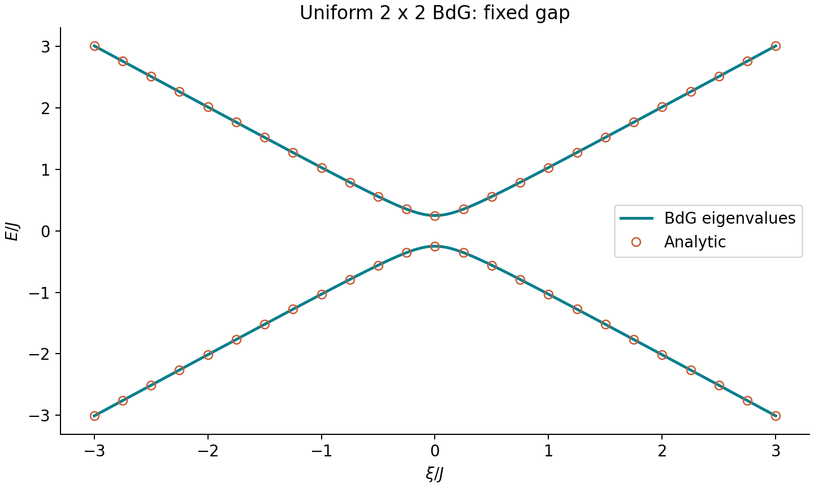
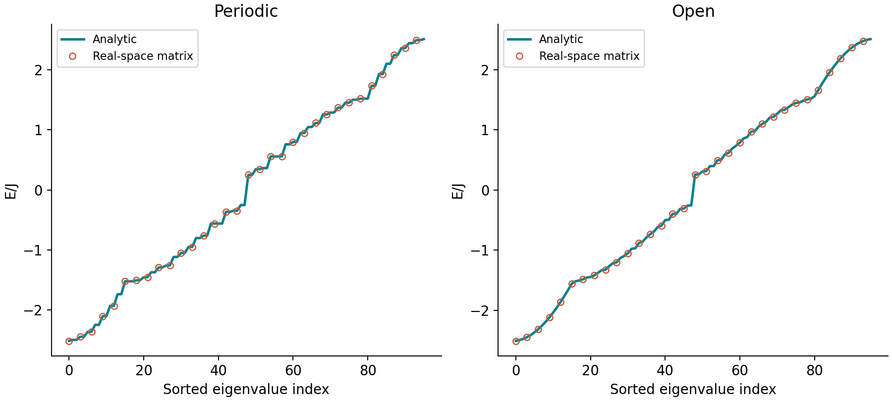
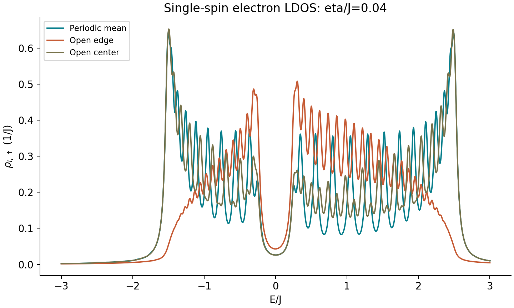
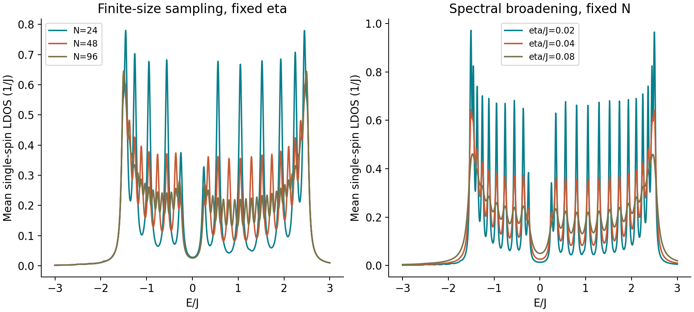
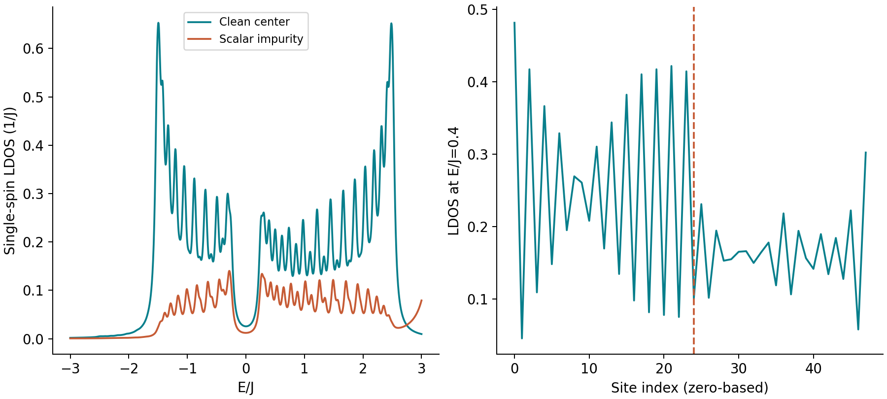

# BdG 理论与计算入门教程

Bogoliubov–de Gennes Theory and Numerical Computation

[本课入口](README.md) · [上一课：BCS](../01_bcs_gap/BCS理论与计算入门教程.md) · [配套课件](../../slides/BdG超导理论与计算入门.pptx) · [已执行 Notebook](BdG入门交互教程.ipynb)

## 0. 学什么，不学什么

BCS 第一课回答“给定配对作用，Δ 随温度如何变化”；BdG 第二课回答“给定 Δ，电子与空穴混合后有哪些激发态，它们在哪里”。
两者是同一平均场物理的不同数值入口，不代表两种独立配对机制。

本课目标：

1. 从 2×2 矩阵推导准粒子能谱（quasiparticle spectrum）。
2. 建立周期/开放一维紧束缚链，比较解析和数值结果。
3. 计算局域态密度（local density of states, LDOS）并检验权重。
4. 分辨有限尺寸、绘图展宽、边界和标量杂质的影响。
5. 用可重复检查约束物理解读，不把普通谱峰误认成 Majorana 零模。

这里只输入固定、通常均匀的 s 波 Δ。没有配对相互作用常数、温度自洽循环、材料轨道、
自旋轨道耦合或磁场，也没有电流或散射矩阵。
因此不能从本课预测 Al 的 Tc、证明某材料的配对机制，或得到拓扑不变量。
一维链仅是易检验的平均场练习，不表示真实一维体系必然存在有限温长程超导序。

## 1. 先修知识与学习安排

先知道复数共轭、矩阵厄米共轭、本征值、二次量子化（second quantization）和化学势（chemical potential）。
不会时可先完成以下最小练习：

~~~python
import numpy as np
A = np.array([[1, 0.2j], [-0.2j, -1]], dtype=complex)
e, v = np.linalg.eigh(A)
assert np.allclose(A, A.conj().T)
assert np.allclose(A @ v, v * e)
~~~

推荐用 3 次学习完成，每次 60–90 分钟；耗时只是建议，不是完成承诺。

| 次数 | 内容 | 独立产物 |
|---|---|---|
| 1 | 第 2–4 节，Notebook 前两格 | 手推 ±E 和相干因子 |
| 2 | 第 5–7 节，Notebook 中间三格 | 两种边界的误差与 LDOS 图 |
| 3 | 第 8–12 节 | 单变量扫描、练习答案、局限说明 |

## 2. 单位、符号与基底

| 符号 | 英文 | 含义及本课约定 |
|---|---|---|
| J | hopping amplitude | 最近邻跃迁能，J>0，默认作为能量单位 J=1 |
| μ | chemical potential | 默认 -0.5J；不固定粒子数、不自洽求 μ |
| ξ | normal-state energy relative to μ | 正常态相对化学势能量 |
| Δ | pairing field / order parameter | 输入配对场，默认 0.25J，可为复数 |
| N | number of sites | 格点数，默认 48，要求整数且至少 3 |
| U_i | scalar potential | 自旋无关的局部标量势，不是磁交换场 |
| η | Lorentzian broadening | LDOS 绘图展宽，默认 0.04J |
| a | lattice spacing | 取 a=1，不涉及真实晶格长度 |

本课实空间 Nambu 基底（Nambu basis）为

$$
\Psi=(c_{1\uparrow},\ldots,c_{N\uparrow},
c^\dagger_{1\downarrow},\ldots,c^\dagger_{N\downarrow})^T.
$$

它是自旋单态（spin singlet）体系的 **2N 维约化块**，不是单个无自旋费米子上的 on-site 配对。
无自旋同轨道 on-site 配对受费米反对称性限制；Kitaev 链通常使用格点间 p 波配对，
不能将本课的 Δ 直接改名为“无自旋配对”。
完整自旋 Nambu 描述一般包含另一块，计数和对称算符需要连同基底重新说明。

## 3. 从 2×2 BdG 块推导能谱

沿用第一课的配对负号约定：

$$
H_{\rm BdG}(\xi)=
\begin{pmatrix}\xi&-\Delta\\-\Delta^*&-\xi\end{pmatrix}.
$$

1. 求特征行列式：
   $\det(H-EI)=E^2-\xi^2-|\Delta|^2$。
2. 因而 $E_\pm=\pm\sqrt{\xi^2+|\Delta|^2}$。
3. ξ=0 时正能为 |Δ|，两个分支间距为 2|Δ|。
4. Δ=0 时恢复正常态电子/空穴分支；排序结果为 ±|ξ|。

符号约定不同的文献可能写 +Δ。整体配对负号可以通过相位约定改变；
比较代码时先核对基底、共轭与规范，不只比较某个矩阵元。
相位变化不改变均匀体系的本征值，但本征矢中的相对相位会变化。

~~~python
from bdg import momentum_block
import numpy as np
xi, delta = 0.6, 0.25
H = momentum_block(xi, delta)
e, v = np.linalg.eigh(H)
print(e)  # [-0.65, 0.65]
~~~

用 eigh 而非 eig：前者利用厄米结构、返回实本征值且按升序排列。
v 的第 ν 列是第 ν 个本征矢，不是第 ν 行。

## 4. 相干因子与电子–空穴混合

正能态写作 $(u,v)^T$，归一化后

$$
|u|^2=\frac12(1+\xi/E),\qquad
|v|^2=\frac12(1-\xi/E),\qquad |u|^2+|v|^2=1.
$$

远离费米面，激发接近纯电子或纯空穴；ξ=0 时两者权重各 1/2。
这是相干因子（coherence factors），不是“电子真的少了一半”。
BdG 的加倍描述与可观测电子谱的权重计数必须区分。

## 5. 正常态链与两种边界

正常态单粒子矩阵为

$$
h_{ij}=-J(\delta_{i,j+1}+\delta_{i,j-1})+(U_i-\mu)\delta_{ij}.
$$

开放边界（open boundary conditions, OBC）：只有 1–2、2–3、…、N-1–N 的键。
周期边界（periodic boundary conditions, PBC）：额外连接 N–1，构成环。
N=2 环的键计数容易产生约定歧义，本课明确限制 N≥3。

均匀无势情况下，正常态解析能量：

| 边界 | 允许波数 | 相对能量 |
|---|---|---|
| PBC | $k_m=2\pi m/N,\ m=0,\ldots,N-1$ | $\xi_m=-2J\cos k_m-\mu$ |
| OBC | $k_m=\pi m/(N+1),\ m=1,\ldots,N$ | 同上；本征态为站波 |

均匀 on-site Δ 下，$E_{m,\pm}=\pm\sqrt{\xi_m^2+|\Delta|^2}$。
有限链未必包含 ξ=0 的模式，所以最低正能可能 **大于** |Δ|。
不要把这个偏离直接解释为新的超导能隙或代码错误。

## 6. 从正常态矩阵到 2N×2N BdG

定义 $D=\mathrm{diag}(\Delta_1,\ldots,\Delta_N)$：

$$
\mathcal H=
\begin{pmatrix}h&-D\\-D^\dagger&-h^*\end{pmatrix}.
$$

先写 h，后写 D，再按 block 组装：

~~~python
from bdg import bdg_chain, analytic_chain_spectrum
H = bdg_chain(48, mu=-0.5, delta=0.25, boundary="open")
e, v = np.linalg.eigh(H)
expected = analytic_chain_spectrum(48, mu=-0.5, delta=0.25, boundary="open")
assert np.max(abs(e - expected)) < 1e-12
~~~

算法成本：本课密集矩阵本征求解约 O(N³) 时间、O(N²) 内存。
N=24–96 足够练习；不要把“直接将 N 增加到十万”当作下一步。
大尺度问题需要稀疏矩阵、选定能窗求解或 Green 函数方法，不能照搬本课所有态求和实现。

## 7. 三种必要的正确性检查

**厄米性（Hermiticity）**

$$\|\mathcal H-\mathcal H^\dagger\|_{\max}\ll1.$$

**本征对残差（eigenpair residual）与完备性（completeness）**

$$\|\mathcal HV-V\,\mathrm{diag}(E)\|_{\max}\ll1,\quad V^\dagger V=I.$$

**约化块粒子–空穴结构（particle–hole structure）**

在本课 h 实对称、D 对角的约定下，反幺正算符 $C=\tau_y\otimes I_N\,K$，
其中 K 表示复共轭。它满足

$$C\mathcal HC^{-1}=-\mathcal H,\qquad C^2=-1.$$

代码检验的是 $U_C\mathcal H^*U_C^\dagger+\mathcal H=0$。
这里的 C²=-1 是该自旋单态约化块的表示，不能写成“所有 BdG 的粒子–空穴算符都平方为 -1”。
完整自旋空间和无自旋基底有不同表示；混用 τ_xK 与 τ_yK 会得到错误检查。

排序后还应检验 $E_\nu+E_{2N-1-\nu}\approx0$。
有简并时本征矢可在子空间内任意旋转，不要要求两次求解的某一列逐元素相同。

## 8. 正确计算单自旋电子 LDOS

全部 2N 个本征矢上半部分记为 $u_{i\nu}$。本课选择全能谱公式：

$$
\rho_\uparrow(i,E)=\sum_{\nu=1}^{2N}|u_{i\nu}|^2 L_\eta(E-E_\nu),\quad
L_\eta(x)=\frac{\eta}{\pi(x^2+\eta^2)}.
$$

由完备性，$\sum_\nu|u_{i\nu}|^2=1$；无限能量范围内积分为 1。
若只对正能态求和，可等价使用

$$
\rho_\uparrow(i,E)=\sum_{E_\nu>0}
\left[|u_{i\nu}|^2L_\eta(E-E_\nu)+|v_{i\nu}|^2L_\eta(E+E_\nu)\right].
$$

后式适用于本课无零模、相应粒子–空穴配对成立的情形。
**二选一**：对全部态求和后再加负能伙伴，会重复计算。
完整两自旋总 DOS 在本课自旋对称条件下可乘 2，但不能再把这个因子乘进单自旋完备性检查。

~~~python
from bdg import electron_ldos
grid = np.linspace(-3, 3, 1201)
rho = electron_ldos(grid, e, v, eta=0.04)
center = rho[:, 24]
weight = np.trapz(center, grid)
print(weight)  # 约 0.986922，有限窗漏掉 Lorentzian 尾部
~~~

有限窗积分不到 1 不必是错误：扩大窗并减小积分网格，检查是否逐步接近 1。
不要人为归一化掩盖权重和计数问题。
±E 本征值对称不保证电子 LDOS 严格偶对称，因为正负能的电子权重可不同；
μ 不在正常态粒子–空穴对称点时尤其如此。

## 9. 展宽与有限尺寸应分开扫描

η 越小，有限尺寸离散峰越明显；η 太大则把谱隙填平。
Lorentzian 尾部在 gap 内留下小权重，并不表示出现 gap 内本征态。
本课 η 是可控绘图参数，不是从散射理论得到的寿命，也不是 QE 的电子占据展宽 degauss。

做两张独立对比图：

1. 固定 η=0.04，改变 N=24、48、96，观察离散化。
2. 固定 N=48，改变 η=0.02、0.04、0.08，观察平滑程度。

中心 LDOS 接近体相结果需要足够尺寸，并考虑展宽；边界站波权重则可保持不同。
不同 N 的最低正能未必严格单调，离散波数接近费米点的程度会变化。

## 10. 一个安全的杂质练习

仅在中心格点加标量势 U=2J，不改变均匀 Δ：

~~~python
potential = np.zeros(48)
potential[24] = 2.0
impurity_H = bdg_chain(48, mu=-0.5, delta=0.25, potential=potential)
impurity_e = np.linalg.eigvalsh(impurity_H)
assert np.min(abs(impurity_e)) >= 0.25 - 1e-12
~~~

原因：实对称 h 可以用实正交变换对角化，常数 D=ΔI 不随此变换改变；
每个正常态 ε 对应 $±\sqrt{ε^2+|\Delta|^2}$。所以本课标量杂质不产生 |E|<|Δ| 的本征态。
它会改变正常态能级和局部谱权重。

磁性杂质可能涉及 Yu–Shiba–Rusinov 态（YSR states），但需要正确引入自旋交换与完整模型。
Majorana 零模还需要合适的拓扑体系及验证。
**开放边界、粒子–空穴对称或看见一个接近零的谱峰，都不是 Majorana 证据。**
固定 Δ 的这一练习也不是无序平均或自洽条件下 Anderson 定理的数值证明。

## 11. 常见问题

| 现象 | 优先检查 |
|---|---|
| 能谱有显著虚部 | 是否错误使用非厄米矩阵或一般 eig |
| ±E 不成对 | 下右块共轭与负号、配对块、基底定义 |
| LDOS 权重为 2 或 4 | 是否同时使用全谱与正能公式、是否混入自旋因子 |
| gap 内有少量曲线权重 | 先检查本征值，再检查 Lorentzian 尾部 |
| 最低正能大于 Δ | 有限链是否包含 ξ=0 |
| PBC 与 OBC 曲线不同 | 允许波数和站波权重本来不同 |
| 改整体相位后能谱改变 | 复数共轭是否遗漏 |
| 改空间相位后能谱改变 | 空间相位梯度不是简单整体规范变化 |

## 12. 练习与参考答案

1. 手算 ξ=0.6、Δ=0.25 的两本征值。
   答：±0.65；正能电子权重 $(1+0.6/0.65)/2$，约 0.961538。
2. 将 Δ 设为 0，证明恢复正常态。
   答：矩阵变为 h 与 -h* 两块；排序后与 ±|ε| 一致。
3. 为什么有 2N 个本征值但每个格点的单自旋电子积分权重是 1？
   答：Nambu 描述包含电子/空穴分量；电子投影的完备性给出权重 1，不能直接计所有态为电子。
4. 为什么本课不能计算 Tc？
   答：Δ 是外部输入，没有相互作用、温度与自洽方程；也没有材料 EPC。
5. 为什么标量杂质没有 gap 内本征态？
   答：均匀 ΔI 与实 h 可同时用于分解成 2×2 块，$|E|\ge|\Delta|$。
6. 如何检验零能峰是否只是绘图效果？
   答：查看原始本征值、η 和 N 依赖、局域权重及适用模型；这些还不足以证明拓扑，需要额外不变量与稳定性分析。

建议写一页学习记录：基底、参数、一个解析证明、三项数值误差、一张参数扫描图、三条局限。

## 13. 之后如何衔接

**模型路线**：先设计并推导带相互作用的自洽 BdG，明确双计数、温度、填充、混合迭代和自由能比较，
再研究真实边界抑制、杂质、Josephson 结。不可简单把所有 Δ_i 更新为同一常数后宣称做了非均匀自洽。

**材料路线**：同时完成 [Al 截断能扫描](../04_qe_al_cutoff/README.md)，再扫描 k 网格、展宽和 ecutrho，
验证声子后才进入 EPC/Eliashberg。BdG 中的 J、μ、Δ 不是 QE 输出数值的直接同名替代。

**文献路线**：此课是解析基准复现，不是原始论文图表复现。选题时先限定一个图号，
记录模型、基底、边界、参数和原图数据，再使用仓库复现模板。

## 14. 来源与复用

- [BCS 原始论文](https://doi.org/10.1103/PhysRev.108.1175)：平均场与准粒子背景。
- [Kwant 官方超导教程](https://kwant-project.org/doc/1/tutorial/superconductors)：进一步学习 Nambu 结构与输运，采用其文中自己的基底约定；本课没有复现其电导。
- [已有开放教材与许可记录](../../resources/开放教材与复用说明.md)：第一套材料中的 MIT OCW PDF，继续保留原许可。

本文、代码、数值图和课件为本仓库原创教学材料，不直接复制未获授权的第三方讲义、图像或教材章节。
整理与执行日期：2026-10-03。
