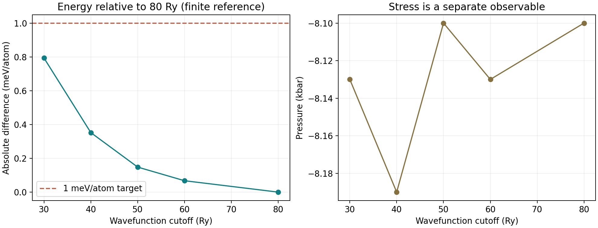

# Al 截断能收敛教程与记录

Wavefunction Cutoff Convergence for Aluminium

[案例入口](README.md) · [上一材料案例](../02_qe_al_smoke/第一性原理与集群入门.md)

## 1. 为什么先做收敛

第一性原理计算（first-principles calculation）仍含可控数值近似：
有限平面波基组、有限 k/q 采样、金属占据展宽和迭代阈值。
SCF convergence（自洽迭代收敛）仅说明某个固定数值问题求解稳定，
不等于 basis-set convergence（基组收敛），更不等于 phonon/EPC/Tc convergence。

本案例仅问：固定其他参数时，波函数截断能从 30 增至 80 Ry，对每原子总能影响有多大？
按 [QE 官方输入说明](https://www.quantum-espresso.org/Doc/INPUT_PW.html)，ecutwfc 与 ecutrho
分别控制波函数和电荷密度/势的平面波截断。
PAW/超软赝势的电荷密度要求不能仅凭“固定为波函数的四倍”决定。

## 2. 单变量设计

| 参数 | 本次设置 | 原因/限制 |
|---|---|---|
| ecutwfc | 30,40,50,60,80 Ry | 唯一改变的输入参数 |
| ecutrho | 640 Ry | 所有组相同；尚未独立验证它收敛 |
| 结构 | fcc，ibrav=2，celldm(1)=7.65339 bohr | 固定几何，未优化晶格 |
| 原子数 | nat=1 | 因此能量差自然为每原子值 |
| k mesh / shift | 8×8×8 / 1,1,1 | 固定；还未完成金属 k 网格收敛 |
| occupations / smearing | smearing / mv | Marzari–Vanderbilt cold smearing |
| degauss | 0.02 Ry | 固定；不是 BdG LDOS 的 η |
| conv_thr | 1.0×10^-10 Ry | 内层 SCF 阈值 |
| 赝势 | Al.pbe-n-kjpaw_psl.1.0.0.UPF | 同一文件、同一校验值 |

注意之前冒烟测试使用的 ecutrho 与这里不同，
不能将那次与这里的总能差归结为只改变 ecutwfc。
本次 pw.x 输出注明 total energy 为 F=E-TS，含相应占据处理；
固定 smearing 时可作当前数值参数对比，不把它误称为严格零温无限基组能量。

## 3. 输入与运行顺序

读每个 scf.in，确认只改 ecutwfc。所有计算从各自目录运行，outdir='./scratch'，
避免多个案例相互覆盖保存数据。
submit.sh 一次提交 5 个顺序 SCF，不是 5 次重复提交；
每步要求正常返回并含 JOB DONE，然后打印对应 ECUT_*_OK。

本次环境：

~~~bash
module load StdEnv/2023 gcc/12.3 openmpi/4.1.5 quantumespresso/7.5
~~~

这条命令是本次集群记录，不保证适用其他集群。
调度配置 job-name=test、partition=iq-main、ntasks=4、mem=8G、time=00:30:00。
参数预算小，但仍按照 HostBridge 约定在计算节点上运行，而不是登录节点上跑 pw.x。

## 4. 输出逐项读什么

1. 程序版本与赝势：确定软件和模型一致。
2. “convergence has been achieved”：内层 SCF 达到阈值。
3. 以 ! 开头的最终 total energy：不要误取前几轮能量。
4. Fermi energy 和 pressure：是独立观测量，不能只看总能。
5. JOB DONE：程序正常结束标志；调度 COMPLETED 仍需科学输出检查。

collect_results.py 缺失任一必需字段、未收敛或未正常结束时拒绝生成成功结论。
test_collect.py 有 4 项解析器与有限参考判据测试。

## 5. 实测数据与误差定义

参考为本次最高 **80 Ry**，不是无限基组真值。
换算 $1\,\mathrm{Ry}=13605.693122994\,\mathrm{meV}$，且每胞一原子：

$$
\delta E(E_{\rm cut})=
[E(E_{\rm cut})-E(80\,{\rm Ry})]\times13605.693122994
\quad{\rm meV/atom}.
$$

| ecutwfc (Ry) | 最终能量 (Ry) | 与 80 Ry 差 (meV/原子) | Fermi energy (eV) | 压力 (kbar) |
|---|---|---|---|---|
| 30 | -39.50300654 | 0.793348 | 7.8175 | -8.13 |
| 40 | -39.50303898 | 0.351979 | 7.8174 | -8.19 |
| 50 | -39.50305397 | 0.148030 | 7.8173 | -8.10 |
| 60 | -39.50305990 | 0.067348 | 7.8173 | -8.13 |
| 80 | -39.50306485 | 0（参考） | 7.8173 | -8.10 |

所有组均在 5 次迭代后收敛。最高点差为 0 是定义，不是它误差为零。
数据保留了 pw.x 打印精度，不能据此讨论小于打印舍入误差的差别。

## 6. 如何作出有限结论

预先设教学阈值 1 meV/原子，寻找最低测试截断能，
且该点及所有更高已测试点相对参考均在阈值内。程序不把孤立点的偶然接近判为稳定区。

本次：最低测试点 30 Ry 满足该 **总能有限参考判据**。
这不说明 30 Ry 以下也满足，不排除 80 Ry 以上有进一步变化，也不能保证力、应力、
声子频率或电子–声子矩阵元足够精确。
若改用 0.1 meV/原子目标，这组数据的最低合格测试点为 60 Ry。
阈值是任务驱动的选择，不能为了得到便宜参数而事后放松标准。

压力约 -8 kbar，说明这个固定几何并非本次设置下的零压平衡点；
它不等于实验压力，也不自动意味着不稳定。
若要研究声子或材料参数，之后需在收敛参数下检查几何优化与力/应力目标。
总能误差满足阈值，不保证应力以同样精度收敛。

## 7. 可追溯性

- 日期 2026-10-03；JobID 313292；COMPLETED；ExitCode 0:0；Elapsed 00:00:18。
- WorkDir：/home/runhan/work_superconductor_bdg_20261003/04_qe_al_cutoff。
- [调度与模块日志](results/slurm-313292.out) 保存版本、可执行文件、赝势哈希及各输入哈希。
- [机器可读记录](results/cluster_record.json) 保存回收日志的集群 SHA256。
- [分析报告](results/validation.json) 保存本地输入/输出 SHA256、参数、阈值和逐行数据。
- [CSV](results/cutoff_scan.csv) 便于自己重新作图。

保存的小型原始日志与集群哈希逐字节核对。scratch/WFC 未上传，赝势未再分发。
重复运行时应另建目录并记录新 JobID；不要把本次 JobID、日期和阈值当成未来运行的实际状态。

## 8. 下一步与验收

1. 在候选截断能下扫描 k 网格，例如 8³、12³、16³、20³，保持结构与展宽固定。
2. 选择足够密 k 网格，再测试 degauss，并检查两者联动；不是单独把展宽压到极小。
3. 独立测试 ecutrho，确认当前 640 Ry 是否合适。
4. 用明确力/应力标准检查或优化结构，再比较 Γ 与有限 q 声子。
5. 检验声子 q 网格及 EPC k/q 网格、插值与展宽，之后才进入 α²F、λ 和 Eliashberg Tc。

以上是后续计划，本次未执行新的 k 网格、ecutrho 或 EPC 扫描。
暂不将 Γ 点声学模式接近零或某个总能阈值作为“Al 超导计算完成”的证据。

独立练习：重新运行分析器，将阈值改为 0.1 meV/原子；手算 40 Ry 的误差；
从任一日志定位最终能量、SCF 成功标志和压力；写出本次至少四个仍未验证的变量。
完成后恢复默认报告，或把自己的分析保存至独立目录。

参考：[QE 官方 pw.x 输入说明](https://www.quantum-espresso.org/Doc/INPUT_PW.html)、
[EPW 官方超导教程](https://docs.epw-code.org/tutorials/tutorial_04/index.html)、
[HostBridge](https://github.com/LRH123LRH123/HostBridge)。
