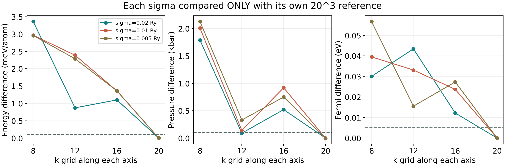
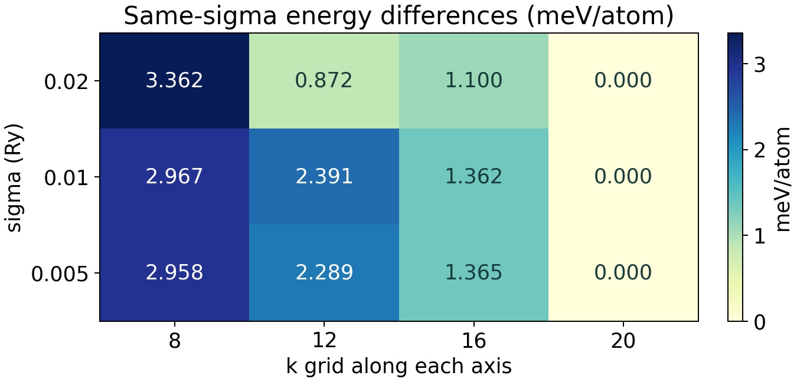
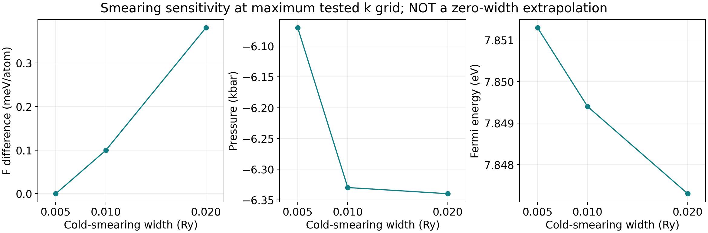

# Al k 网格与展宽集群测试记录

[详细教程](Al金属k网格与展宽收敛教程.md) · [案例入口](README.md)

## 运行身份

- 学习记录日期：2026-10-03（America/New_York）；完成状态回收时间：2026-10-04T00:18:45Z（UTC）。
- JobID：313714；COMPLETED；ExitCode 0:0；Elapsed 00:18:25。
- WorkDir：/home/runhan/work_superconductor_kmesh_20261003/05_qe_al_kmesh_smearing。
- 本次分区 iq-maiagv，4 MPI，8G，1 小时预算；只提交一次，顺序执行 12 组。
- Quantum ESPRESSO 7.5；StdEnv/2023、gcc/12.3、openmpi/4.1.5。
- 固定 60/640 Ry、fcc 晶格、nbnd=6、同一 PAW 赝势、shift=1,1,1 和 SCF 阈值。

## 完整数据

最终 total energy 使用 QE 输出的 F=E−TS；每胞 1 个原子。
所有组均在 5 次 SCF 迭代后收敛并包含 JOB DONE。

| 案例 | k 网格 | σ (Ry) | 不可约点数 | F (Ry) | 压力 (kbar) | Fermi (eV) | 同 σ 能差 (meV/原子) |
|---|---|---|---|---|---|---|---|
| k08_s020 | 8³ | 0.020 | 60 | -39.50305990 | -8.13 | 7.8173 | -3.361967 |
| k12_s020 | 12³ | 0.020 | 182 | -39.50274868 | -6.25 | 7.8907 | 0.872397 |
| k16_s020 | 16³ | 0.020 | 408 | -39.50273192 | -5.82 | 7.8351 | 1.100428 |
| k20_s020 | 20³ | 0.020 | 770 | -39.50281280 | -6.34 | 7.8473 | 0.000000 |
| k08_s010 | 8³ | 0.010 | 60 | -39.50305152 | -8.34 | 7.8099 | -2.966721 |
| k12_s010 | 12³ | 0.010 | 182 | -39.50265774 | -6.19 | 7.8825 | 2.390928 |
| k16_s010 | 16³ | 0.010 | 408 | -39.50273334 | -5.41 | 7.8257 | 1.362338 |
| k20_s010 | 20³ | 0.010 | 770 | -39.50283347 | -6.33 | 7.8494 | 0.000000 |
| k08_s005 | 8³ | 0.005 | 60 | -39.50305821 | -8.20 | 7.7946 | -2.958286 |
| k12_s005 | 12³ | 0.005 | 182 | -39.50267257 | -6.40 | 7.8668 | 2.288614 |
| k16_s005 | 16³ | 0.005 | 408 | -39.50274047 | -5.32 | 7.8240 | 1.364787 |
| k20_s005 | 20³ | 0.005 | 770 | -39.50284078 | -6.07 | 7.8513 | 0.000000 |

参考为同 σ 的 20³；符号表示相对参考的方向。参考自身 0 不是无限网格误差为 0。
完整 F、internal E、-TS、SCF accuracy、差值与警告计数见 [CSV](results/kmesh_smearing_scan.csv)。

## 事先设定的判据与结果

标准：|δF|≤0.1 meV/原子、|δP|≤0.1 kbar、|δEf|≤0.005 eV。
候选点及所有更高测试点必须同时通过，且不能仅剩参考自己。

| σ (Ry) | 有限参考 | 非参考点的联合候选 |
|---|---|---|
| 0.020 | 20³ | 没有；本扫描未证明稳定 |
| 0.010 | 20³ | 没有；本扫描未证明稳定 |
| 0.005 | 20³ | 没有；本扫描未证明稳定 |

**三个平面均无联合候选，不能将 20³ 直接宣称为已收敛设置。**
这是一个完成且可复查的扫描实验，不是算法失败，也不是材料计算已充分收敛。
例如 σ=0.020 时，16³ 相对 20³ 的 |δF|≈1.100428 meV/原子、
|δP|=0.52 kbar、|δEf|=12.2 meV，均不满足设定目标。
同 σ 的 12³ 压力差 0.09 kbar 可通过，但总能与 Fermi energy 不通过；
这说明不同观测量可能不同步。

## 展宽敏感性而非零宽外推

固定 20³，三种 σ 的范围：
- F 总能跨度：0.380687 meV/原子。
- internal E 跨度：0.291842 meV/原子。
- 压力跨度：0.27 kbar。
- Fermi energy 跨度：4.0 meV。

这些数值只描述本次最密已测网格上的敏感性，不是零宽误差估计，
也不表示最窄 σ 就是真实值，因为该平面的 k 收敛仍没有被证明。

## 警告、检查与可追溯性

部分中间迭代出现 c_bands: eigenvalues not converged 信息。
全扫描共有 45 条此类信息，最终迭代均为 0；已保存计数，不删除原始警告。
最大最终 estimated scf accuracy 为 3.50e-11 Ry，低于 1×10^-10 Ry。

分析器检查 F−C=E 的打印精度恒等式，并拒绝最终迭代仍有本征值警告的日志。
8 项单元测试通过，覆盖解析、输出缺失、联合判据、非单调数据、输入契约和警告处理。
交互 Notebook 的 6 个代码单元已实际执行。

[机器可读来源记录](results/cluster_record.json) 保存输入计划、脚本、12 组输入/输出和调度日志的来源 SHA256；
仓库验证脚本逐字节核对，并从原始输出重算 [validation.json](results/validation.json)。
[调度与模块日志](results/slurm-313714.out) 含真实模块、赝势哈希、每组输入哈希和完成标志。
scratch/WFC 与赝势未再分发；分析代码、CSV 和三张图可本地重建。

## 与上一轮的连接

本次 k08_s020 的 F=-39.50305990 Ry，与上一轮 60 Ry、8³、σ=0.020 的最终打印总能相同；
压力和 Fermi energy 也一致。这提供基线衔接检查，不是新的收敛证明。
实际不可约点数为 60、182、408、770，不是 8³、12³、16³、20³ 的原始点数。

单原子 fcc 的对称性可使原子力为 0，但压力仍不为 0；
不要用零原子力宣称晶格常数已经优化。

## 下一轮应该补什么

1. 先增加更密 k 参考，例如 24³、28³、32³，在相同三种 σ 下比较；
   若仍未达到预设目标，再扩大参考或调整有依据的目标，不能保证这三个网格必然足够。
2. 结合密 k 检查展宽范围与更多 σ 点；明确有限占据处理和零宽极限策略。
3. 在稳定积分设置下回查 ecutwfc、ecutrho 和几何/应力，之后才讨论有限 q 声子与 EPC。
4. 若未来改成不同网格偏移、展宽方法或赝势，另建实验，不混为同一单变量序列。

这些是后续建议，本次没有提交 24³ 以上计算、几何优化或 EPC。
当前状态应写为“12 组扫描完成，电子联合阈值尚未证明”，而不是“Al 超导计算完成”。
