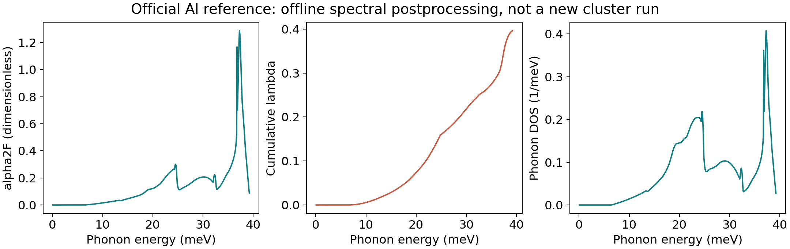
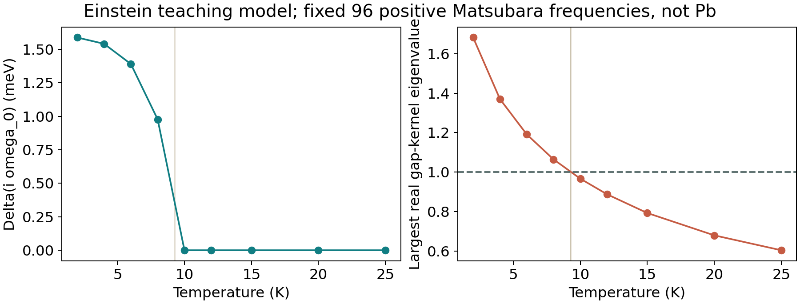
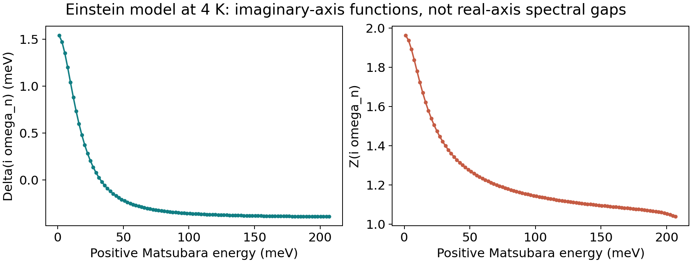
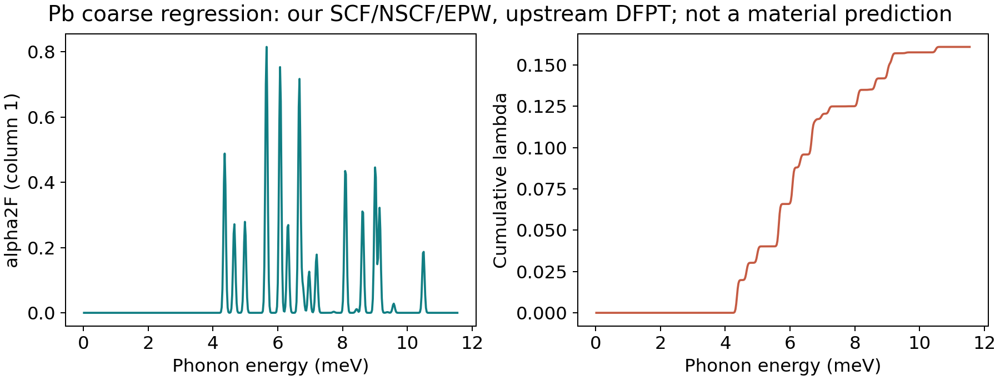

# 电子声子耦合与 Eliashberg 入门教程

Electron-Phonon Coupling and Migdal-Eliashberg Theory

[案例入口](README.md) · [结果对照](学习结果与基准对照.md) · [Pb 流程](Pb固定参数计算流程.md)

## 0. 本课要解决的问题

BCS 教程里相互作用常被压缩成一个常数，BdG 教程里能隙甚至是固定输入。
真实声子介导材料却有不同声子模式、不同电子散射通道以及随频率变化的自能。
本课回答：这些信息如何进入谱函数，再进入临界温度和能隙方程？

先修知识是 Cooper 配对、BCS 能隙、费米面、矩阵本征值和基本 Python。
如果不熟悉 Green 函数，先把 Z 理解为正常自能引起的频率重整化，
把 Δ 理解为随虚频变化的配对函数，然后再回到 Nambu 自能推导。

**本课不继续采样密度、能量截断或展宽扫描。** 固定参数是教学范围，
不是“不需要收敛检查”的物理结论。此前 Al 未通过联合判据的记录仍然有效。

三条学习线必须分开：Al 是官方参考数据后处理；Einstein 是模型方程求解；
Pb 是官方小型软件回归的集群复跑。不能把三者拼成“Al/Pb 已完成第一性原理 Tc 预测”。

## 1. 从声子到电子散射

### 1.1 电子声子耦合（Electron-Phonon Coupling, EPC）

晶格位移改变电子感受到的势。最低阶耦合可以示意写为：

$$H_{ep}=\sum_{mn\mathbf{kq}\nu\sigma}g_{mn\nu}(\mathbf{k,q})
c^\dagger_{m,\mathbf{k+q},\sigma}c_{n,\mathbf{k},\sigma}
(b_{\mathbf q\nu}+b^\dagger_{-\mathbf q\nu}).$$

`c` 描述电子，`b` 描述声子，ν 是声子分支，g 是散射矩阵元。
电子从 k 到 k+q，吸收或发射一个声子。第一性原理计算需要电子波函数、
声子本征矢及势对位移的响应；只知道声子频率不够。

DFT 给出基态电子结构；密度泛函微扰理论（Density-Functional Perturbation Theory, DFPT）
计算晶格位移的一阶响应；Wannier 插值把粗网格矩阵元转移到细网格。
插值提高求和效率，不自动弥补粗网格缺失的信息。
这些对象的严格归一化定义见 [EPW 理论文档](https://docs.epw-code.org/Theory.html)。

### 1.2 迟滞与近似边界

迟滞相互作用（Retarded Interaction）意味着电子相互作用不是瞬时常数。
声子传播子携带频率结构，频率差大的两次散射所对应的吸引会衰减。
Migdal 近似忽略特定顶角修正，通常依赖声子能标相对电子能标较小及耦合不太极端。
窄带、小费米能、强非绝热性和强关联体系不能自动套用。

本课的各向同性、恒定费米面 DOS、声子介导模型不研究自旋涨落、强关联顶角、
非谐晶格或相位涨落。由此算出的配对不稳定性也不保证二维体系具有同温度全局相位相干。

## 2. 为什么声子 DOS 不能替代 α²F

声子态密度（Phonon Density of States, DOS）只统计声子模式。
Eliashberg 谱函数（Eliashberg Spectral Function）α²F 还包含矩阵元平方及费米面电子态的权重。
同一声子 DOS 可以对应很不同的 EPC。大的峰未必贡献最大的 λ，因为 λ 中还有 1/Ω 权重。

本课统一使用声子**能量** Ω=ℏω，单位 meV；不是把角频率数值直接当 meV。
费米面平均的一种常用能量约定可示意为：

$$A(\Omega)\equiv\alpha^2F(\Omega)
\sim\frac1{N(E_F)}\sum |g|^2\delta(\xi_{n\mathbf k})
\delta(\xi_{m\mathbf{k+q}})\delta(\Omega-\Omega_{\mathbf q\nu}).$$

求和包括规范化 k/q 权重；自旋和 DOS 的归一化必须与程序一致。
此式是物理含义导图，不用于另写未经验证的归一化实现。
按本课的数据约定，A 的纵轴无量纲；声子 DOS 纵轴则是能量的倒数。

### 2.1 最容易出错的单位

| 对象 | 本课单位 | 换算规则 |
|---|---|---|
| Ω、Δ、虚频能量 | meV | 1 Ry = 13605.693122994 meV |
| k_B | meV/K | 0.08617333262145 |
| λ、Z、μ* | 无量纲 | 不乘能量换算系数 |
| A(Ω) | 本数据约定下无量纲 | Ry→meV 改横轴，不额外缩放 A |
| 声子 DOS | 1/meV | 若原值为 1/Ry，除以 13605.693122994 |

原因是 λ 的积分含 dΩ/Ω，横轴的缩放在分子和分母中抵消。
而 DOS 的积分是模式数，改横轴必须补偿纵轴。
如果其他程序定义的是不同规范化谱密度，应从其定义重新做量纲分析，不能照搬此表。

## 3. 三个谱矩和累计贡献

令 A≥0，定义：

$$\lambda=2\int_0^\infty\frac{A(\Omega)}{\Omega}d\Omega,$$
$$\Omega_{\log}=E_0\exp\left[\frac2\lambda\int_0^\infty
\frac{A(\Omega)}\Omega\ln\frac\Omega{E_0}d\Omega\right],$$
$$\Omega_2=\left[\frac2\lambda\int_0^\infty A(\Omega)\Omega\,d\Omega\right]^{1/2}.$$

E0 是为对数提供无量纲自变量的参考能量，代码取 1 meV，最终结果不依赖它。
Ω2 是**二阶矩的平方根**，不是矩本身，也不是普通峰值频率。
累计 λ(Ωmax) 表示只积分到指定能量的贡献。

程序 `moments` 用梯形积分（Trapezoidal Integration）。它只覆盖文件首尾之间，
不假装知道更低频处的谱权重。频率必须严格正且递增，A 必须有限且非负。
零频点不能直接代入 A/Ω；本实现拒绝它，要求使用者先明确低频解析极限。
不能为了让结果好看，自动删除零频、剪裁负值或排序重复点。

### 3.1 官方 Al 参考的第一轮练习

原文件 `reference/qe-7.5/PHonon/examples/tetra_example/reference/aluminum.a2F.dat`
共有 500 行，前三列分别是能量 Ry、A 和声子 DOS（1/Ry）。
它来自 QE 仓库固定提交，**不是此前我们运行的 Al SCF/Γ 点声子产生的谱**。

```python
from epc import load_spectrum, moments
w, a = load_spectrum("reference/qe-7.5/PHonon/examples/tetra_example/reference/aluminum.a2F.dat", "Ry")
m = moments(w, a)
print(m["lambda"], m["omega_log_meV"], m["omega2_meV"])
```

应得到 λ≈0.39621339、Ωlog≈26.53072 meV、Ω2≈29.12235 meV。
用 `qe_rectangle_moments` 重建均匀格点矩形求和，则 λ≈0.39639151，
Ωlog≈26.53539 meV，与供应的 `al.a2F.out` 谱积分结果一致。
供应输出中的直接 q 点求和 λ 是另一个离散对象，不应拿它替代谱积分对照。

为何不同？矩形求和为各格点分配完整格点宽度，梯形积分把首尾权重减半。
该 Al 表最后一行 A 不为零，所以差异不是程序随机误差，也不是单位错了。
先对齐积分规则、区间和列定义，再判断“复现失败”。这里的矩形函数仅为均匀格点参考设计。



## 4. μ* 和 Tc 公式

库仑赝势（Coulomb Pseudopotential）μ* 表示低能有效排斥。
它不等于化学势 μ，不等于 QE 的展宽，也不是每种材料都精确等于 0.1。
教材常用近似 μ*=μ/[1+μ ln(Eel/Eph)] 来说明迟滞降低低能排斥，
但实际有效值依赖能标和模型。本课 0.1 是明确的示例输入，不是拟合结论。

先定义采用 Ωlog 前因子的修正 McMillan 式：

$$T_c^{\mathrm{base}}=\frac{\Omega_{\log}}{1.2k_B}
\exp\left[-\frac{1.04(1+\lambda)}{\lambda-\mu^*(1+0.62\lambda)}\right].$$

这不同于原始使用 Debye 温度前因子的 McMillan 表达。
完整 Allen-Dynes 修正还包括谱形和强耦合因子：

$$T_c^{\mathrm{AD}}=f_1f_2T_c^{\mathrm{base}},\quad
f_1=[1+(\lambda/\Lambda_1)^{3/2}]^{1/3},\quad \Lambda_1=2.46(1+3.8\mu^*),$$
$$f_2=1+\frac{(r-1)\lambda^2}{\lambda^2+\Lambda_2^2},\quad
r=\Omega_2/\Omega_{\log},\quad\Lambda_2=1.82(1+6.3\mu^*)r.$$

两种值分别由 `tc_estimates` 输出，不能把没有 f1/f2 的式子称为完整 Allen-Dynes。
这些式子是近似估计，不是直接解 Migdal-Eliashberg 方程。
Al 数据在 μ*=0.1 下给出约 1.22385 K 和 1.24167 K；只是本数据及公式条件下的示例。
若指数分母非正，代码报错，不返回一个看似正常的 Tc。
原始公式和适用讨论见 [Allen 与 Dynes，PRB 12, 905 (1975)](https://doi.org/10.1103/PhysRevB.12.905)。

## 5. 从谱函数到随频率变化的相互作用

下面开始**独立教学模型**。不是用 Pb 回归谱拟合实验，不是把 Al 数据偷换成 Einstein 模型。
选择单一 Einstein 模式：

$$A(\Omega)=\frac{\lambda\Omega_E}{2}\delta(\Omega-\Omega_E).$$

将它代入 λ 的定义，确实得到输入 λ；谱矩均为 ΩE。
在虚轴定义频率差核：

$$K(\nu)=2\int_0^\infty\frac{\Omega A(\Omega)}{\Omega^2+\nu^2}d\Omega
=\lambda\frac{\Omega_E^2}{\Omega_E^2+\nu^2}.$$

因此 K(0)=λ，K(ν)=K(-ν)，大频率差时衰减。
这就是 `einstein_kernel`，比人为画一个高斯峰再积分更容易得到独立解析检查。
本课尚未实现任意 α²F 的完整 Eliashberg 求解，因此不能把 `moments` 输出直接喂给此函数当材料解。

## 6. 虚轴 Eliashberg 方程怎样变成代码

### 6.1 定义未知量

费米 Matsubara **能量** wn=(2n+1)πkBT；Z_n 是频率重整化函数；
Δ_n 是配对函数；异常自能通常记作 φ_n=Z_nΔ_n。
这里 Z 并不是电子谱的准粒子权重，两者在相应低能极限有关联但不是同一个记号。
使用各向同性、费米面限制、恒定 DOS 及粒子-空穴近似对称的简化。
方程结构可与 [EPW 各向同性理论](https://docs.epw-code.org/Theory.html#isotropic-approximation) 对照。

带正负虚频求和的模型方程为：

$$Z_n=1+\frac{\pi k_BT}{w_n}\sum_mK(w_n-w_m)
\frac{w_m}{\sqrt{w_m^2+\Delta_m^2}},$$
$$Z_n\Delta_n=\pi k_BT\sum_m[K(w_n-w_m)-\mu^*\theta(\Omega_c-|w_m|)]
\frac{\Delta_m}{\sqrt{w_m^2+\Delta_m^2}}.$$

Ωc 指有效库仑项的截止，不能把 μ* 在无限虚频上无条件求和。
本实现取 Ωc=100 meV，正频率数 N=96。
有限求和的最大 wn 随温度改变；它是截断模型，不是已证明达到无限频率极限的材料求解。
本课不做该截断的扫描，结果显式标记未验证截止收敛。

### 6.2 正频率折叠（Positive-Frequency Folding）

用 Δ(-w)=Δ(w)、Z(-w)=Z(w)，配对正频率 m 与负频率 -m-1。
令 Kminus_nm=K(wn-wm)，Kplus_nm=K(wn+wm)。
正常项中 wm 变号，因此相减；配对项中 Δ 不变，因此相加：

$$Z_n=1+\frac{\pi k_BT}{w_n}\sum_{m\ge0}(K^-_{nm}-K^+_{nm})
\frac{w_m}{\sqrt{w_m^2+\Delta_m^2}},$$
$$Z_n\Delta_n=\pi k_BT\sum_{m\ge0}
[K^-_{nm}+K^+_{nm}-2\mu^*\theta(\Omega_c-w_m)]
\frac{\Delta_m}{\sqrt{w_m^2+\Delta_m^2}}.$$

库仑项出现 2，是两边虚频都贡献排斥。漏掉这个 2 会改变结果。
单元测试直接与同样截断的完整正负频率求和比较，而不只检查曲线形状。

### 6.3 线性化与 Tc

在 Δ→0 时先求正常态 Z，配对方程变为 Δ=B(T)Δ：

$$Z_n^N=1+\frac{\pi k_BT}{w_n}\sum_m(K^-_{nm}-K^+_{nm}),$$
$$B_{nm}=\frac{\pi k_BT}{Z_n^Nw_m}
[K^-_{nm}+K^+_{nm}-2\mu^*\theta(\Omega_c-w_m)].$$

最大**实**本征值达到 1 是本课离散模型的配对不稳定条件。
不要使用最大绝对本征值：大的负本征值不是该配对分支的不稳定性。
`instability` 计算本征对及残差；`find_tc` 要求低温端本征值>1、高温端≤1，
然后二分，返回上下界而不是只打印一个过度精确的数字。

### 6.4 非线性求解

`solve_gap` 从有限初值开始，用两条非线性方程更新 Z 和 Δ，混合比例 0.3。
它检查**未混合更新与当前值之差**：Δ 残差<10^-8 meV，Z 残差<10^-9。
只检查混合后的变化会让很小混合因子伪装成“收敛”。
高温线性本征值≤1 时，返回正常态 Δ=0；不能把由零初值永远保持零当作低温没有超导的证据。
一般模型可能有多解或其他分支，本课只处理这个单模式、实、偶频分支，不提供普适稳定性证明。

核心调用：

```python
from epc import find_tc, solve_gap
tc = find_tc(2, 25, lam=1, omega_meV=10, mu_star=0.1)
solution = solve_gap(4, lam=1, omega_meV=10, mu_star=0.1)
print(tc["lower_K"], tc["upper_K"], solution["gap_residual_meV"])
```

本次固定模型给出 Tc 区间约 [9.26050, 9.26611] K。
区间宽度只是二分搜索容差，不是材料预测误差棒，也不包含 Matsubara 截断误差。
Δ(iw0) 是最低虚频的函数值，**不是已经做了解析延拓的实轴激发能隙**。
本课不做 Padé 延拓，也不计算隧穿谱、实轴 DOS 或 2Δ(0)/kBTc 的材料强耦合比。




## 7. 真实 Pb 集群回归：理解“复现了什么”

输入来自 QE 7.5 的 `test-suite/epw_metal`，不是当前大型 Pb 超导教程。
我们重新做 SCF、NSCF、Wannier 化和 EPC 插值，但复用上游保存的 DFPT 动力学矩阵及势响应。
不具备“所有材料步骤均由自己从零完成”的含义。

固定粗 k/q 为 3³，细 k/q 为 6³；60 Ry、scalar-relativistic Pb 赝势、无 SOC。
物理输入在三次提交间没有改变；只修复完成判定和文件格式检查。
Job 313836 为 COMPLETED；前两次为 FAILED，原因在 [完整记录](集群测试记录.md)。

输出 `pb.a2f.01.300.000` 的第一列是 meV，后十列是不同声子谱展宽对应的 A。
本课只选择零基列号 1，即 0.05 meV 的谱，**不展开这些列做展宽扫描或收敛结论**。
尾部有明确文字标记、积分 λ、声子/电子展宽和 Fermi window。
`load_spectrum(..., file_format="epw_legacy")` 对它们作严格验证后读数字段，未知或截断尾部会报错。

模式/q 求和 λ=0.1608797；官方回归参考为 0.1608789，差为 8×10^-7。
谱积分 λ≈0.16088553，与文件尾部 0.1608855 一致。
q 求和与有限展宽谱积分不必最后一位完全相同。
如此小的 λ 不应解释成真实 Pb 材料结论，也不能为了匹配实验调 μ*。



本课的完整原始数字源选用 Job 313824，其物理程序已完成但旧检查器报错；
Job 313836 的成功状态、谱和最终检查脚本另外归档，不把旧日志重命名冒充新作业。
所有来源有 SHA256。浮点 divide-by-zero/underflow/denormal 警告仍保留，
谱及所用输出没有 NaN/Infinity 并不表示所有内部数值问题已全面排除。

## 8. 代码导读与结果验收

| 文件 / 函数 | 阅读问题 |
|---|---|
| `epc.load_spectrum` | 单位和格式是否显式？为什么不猜列？ |
| `epc.moments` | 1/Ω 权重、积分区间和对数参考能量在哪里？ |
| `epc.tc_estimates` | f1/f2 是否存在？为什么返回非 Eliashberg 标记？ |
| `epc.linearized` | 正负频率折叠、库仑截止、Z 的索引是否一致？ |
| `epc.instability` | 实本征值筛选与残差如何检查？ |
| `epc.solve_gap` | 原方程残差和混合更新有何区别？ |
| `run_learning.py` | 来源校验、基准阈值、模型和材料结果如何分开？ |
| `validate_epw.py` | 为什么不对 EPW 强求 PW 的 JOB DONE？ |

`python -m unittest discover -v` 当前有 20 项检查。
它们覆盖单位变换、独立解析谱矩、公式区分、正负频率求和等价、本征/非线性残差、
正常态、无 Tc bracket、负谱/零频/非有限值以及真实 EPW 尾部格式。
测试通过说明实现满足已测模型约束，不说明 DFT 材料参数已收敛。

## 9. 独立练习与答案

1. 将 Al 横轴从 Ry 换成 meV，若把 A 也除以换算常数，λ 会怎样？
2. 为什么只有 DOS 图不能预测 λ？为什么低能峰可能贡献很大？
3. 手算 Einstein 谱的 λ、Ωlog、Ω2 及 K(0)。
4. 写出负虚频对应的索引，解释正常方程的减号和配对方程的加号。
5. μ*=0.1 这个参数能否从一次 SCF 的 Fermi energy 直接得到？
6. 只保留一个极小混合因子，看到每步变化很小，能否判定原方程收敛？
7. Pb 的 λ 与官方软件基准一致，能否宣称预测了实验 Tc？
8. Tc 二分区间宽 0.01 K，是否表示总误差小于 0.01 K？

答案：1. 会错误缩小同样的倍数；A 在此约定下不变。2. 缺少 |g|² 和电子费米面权重，
且 λ 有 1/Ω。3. 分别为 λ、ΩE、ΩE、λ。4. -m-1 对应 -wm，wm 是奇函数，Δ 是偶函数。
5. 不可以，μ* 是依赖筛选/迟滞/截止约定的有效排斥。6. 不可以，需检查未混合的原方程残差。
7. 不可以，当前为粗网格回归、复用 DFPT、无 SOC、未解材料能隙方程。8. 不可以，
它只是有限离散模型的搜索分辨率，不包含模型、截止、谱或电子结构误差。

## 10. 常见问题与下一步

| 现象 | 先检查 | 不应采用的做法 |
|---|---|---|
| 与参考 λ 略不同 | 列、单位、积分规则、端点 | 立即调 μ* 或缩放谱 |
| `Integrated` 无法转为数字 | 选择 epw_legacy 且尾部完整 | 无差别忽略所有非数字行 |
| 无 Tc 区间 | 低温本征值、正常态边界、有效排斥 | 强制打印一个 Tc |
| 迭代达到上限 | 原方程残差、初值、混合、分支 | 静默返回最后一轮 |
| EPW 无 JOB DONE | EPW 专用结束段及进程退出状态 | 套用 PW 的唯一标记 |
| Slurm 完成但数值警告 | 原始 stderr、NaN、基准与物理适用性 | 把 COMPLETED 当科学证书 |

接下来优先做 **方程级文献阅读**：把各向异性方程怎样化为各向同性、
哪些材料信息在平均时丢失，写成自己的符号对照表。任务单见
[Eliashberg 方法文献阅读与复现目标](../../literature/Eliashberg方法文献阅读与复现目标.md)。
后续材料流程可按 [官方 Pb/MgB2 教程](https://docs.epw-code.org/tutorials/tutorial_04/index.html) 走固定参数，
但本课没有执行其大网格计算，也没有复现其完整材料 Tc 或 MgB2 双能隙图。
所有第三方副本的版本、来源和许可见 [来源说明](reference/来源与许可.md)。

本课原创推导、解释、代码和重绘图；检索与整理日期：2026-10-04。
